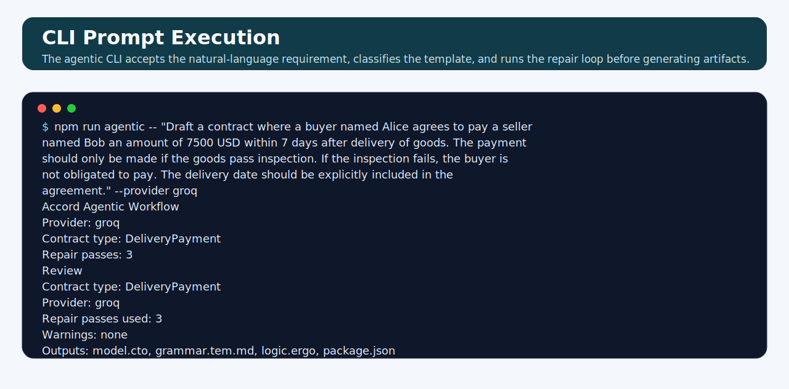
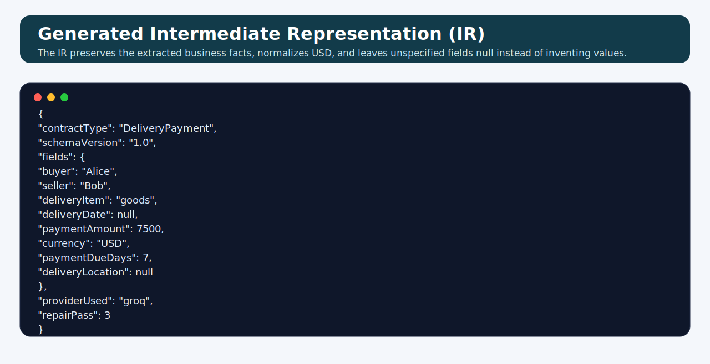
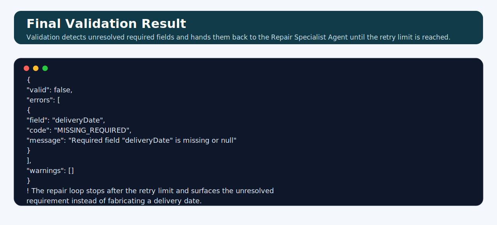
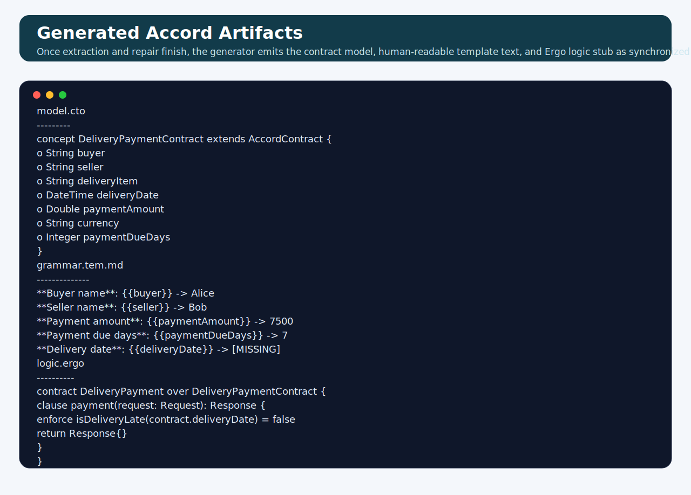

# Accord-Aware LLM Drafting System

## Overview

This project implements a **semantics-aware contract drafting system** that combines:

* **LLM-based natural language understanding (Groq)**
* **Typed Intermediate Representation (IR)**
* **Deterministic contract generation**
* **Accord Project-compatible artifacts**

## Core Idea

Instead of generating contracts directly using an LLM, this system enforces a strict pipeline:

```
Natural Language → LLM (Groq) → Typed IR → Deterministic Generator → Accord Template
```

### Key Principle

> **LLM interprets. The system decides.**

This ensures:

* No hallucinated contract structures
* Strong alignment with Accord’s model-driven design
* Deterministic and verifiable outputs

## Agentic Workflow Extension

This repository includes an **agentic orchestration layer** built on top of the existing drafting pipeline. The agents were developed and analyzed using **CrewAI orchestration**, ensuring each specialist stage is explicitly modeled and traceable. Rather than replacing the deterministic core, the new workflow adds named specialist stages that mirror the real drafting lifecycle:

1. Requirements analysis
2. Contract type classification
3. Schema alignment
4. IR composition
5. Validation
6. Repair
7. Artifact generation
8. Review

The important architectural choice is that the **existing `accord-impl` modules remain the source of truth** for extraction, validation, repair, and artifact generation. The agentic layer simply makes those stages explicit, traceable, and easier to expose through a CLI or future UI.

### Specialist Agents

The current agent definitions live in the new agent layer and map directly to the existing pipeline:

* **Requirements Analyst** → normalize natural-language requirements into a drafting brief
* **Template Classifier** → choose the best supported contract type
* **Schema Alignment Agent** → load the registry schema and supported field structure
* **IR Composer** → build the typed intermediate representation
* **Validation Auditor** → validate schema, template, and business rules
* **Repair Specialist** → repair invalid IR fields using targeted validation feedback
* **Artifact Builder** → generate Accord-compatible artifacts
* **Review Agent** → summarize warnings, repair passes, and outputs

### Agentic Flow

```text
Natural Language Requirements
        ↓
Requirements Analyst
        ↓
Template Classifier
        ↓
Schema Alignment Agent
        ↓
IR Composer
        ↓
Validation Auditor
   ├── pass → Artifact Builder → Review Agent
   └── fail → Repair Specialist → Validation Auditor
```

---

## Template Playground Integration

This system is fully integrated with the **Accord Project Template Playground**, allowing users to switch between the legacy regex engine and the new AI-powered drafting engine.


### Engine Selection
The UI allows users to toggle between the deterministic (Regex) engine and the LLM-powered engine.


### Integration Flow
1. Generate template package: `model.cto`, `grammar.tem.md`, `logic.ergo`, `package.json`.
2. Import into Playground:
   * Upload files
   * Or paste into editor
3. Test:
   * Clause parsing
   * Data binding
   * Logic execution

---

## Generated Artifacts (Visual Analysis)

The system produces three primary Accord Project artifacts from a single contract brief.

### 1. TemplateMark (Grammar)
The generated grammar includes variable bindings and formatted human-readable text.

| Details Extraction | Bound Clause Text |
| :--- | :--- |
|  |  |
|  | |

### 2. Concerto (Data Model)
The system creates a strictly typed Concerto model (`.cto`) that maps exactly to the extracted IR fields.


### 3. Ergo (Executable Logic)
For supported contract types, the system generates executable Ergo logic stubs to handle contract events.


---

## Architecture

```
User Input (Natural Language)
        ↓
LLM Provider (Groq)
        ↓
Typed IR (Contract-Type Aware)
        ↓
Schema Validation
        ↓
Deterministic Generators
   ├── model.cto
   ├── grammar.tem.md
   ├── logic.ergo
   └── package.json
        ↓
Validator + Repair Loop
```

---

## Intermediate Representation (IR)

The IR is the **semantic core** of the system.

### Properties
* Contract-type aware
* Strictly schema-bound
* Supports confidence and ambiguity markers

### Example (LatePenalty)
```json
{
  "contractType": "LatePenalty",
  "obligorParty": "FastFreight Logistics",
  "obligeeParty": "Nexus Retail Group",
  "gracePeriodDays": 3,
  "penaltyRatePercent": 1.5,
  "penaltyPeriod": "WEEKLY",
  "maxPenaltyPercent": 15,
  "currency": "USD"
}
```

---

## Repair Loop Logic

The repair loop starts by validating the extracted **Intermediate Representation (IR)** against the selected contract schema and template rules. If the validator finds missing required fields, wrong types, enum mismatches, or business-rule violations, those errors are passed to the **Repair Specialist Agent** as targeted feedback.

The Repair Specialist updates only the failing fields and sends the revised IR back through validation. This validation-repair cycle continues until the IR passes validation or the configured retry limit is reached. If the requirement is still unresolved after the final retry, the workflow surfaces the remaining error instead of inventing business values.

---

## How to Run

```bash
npm install
npm run demo
```

### Agentic CLI

The repository now also exposes an agentic workflow CLI over the same drafting core:

```bash
npm run agentic -- "Draft a service agreement between DevCo and ClientCorp" --provider groq
```

Artifacts will be automatically saved to a `./generated` directory.

#### Provider Selection

The CLI defaults to a `mock` provider if no other option is specified. 

> [!WARNING]
> The **mock** provider uses static sample data and **will not** process your specific natural language requirements. It is intended only for testing the CLI infrastructure.

To use real LLM-powered drafting, specify a provider with the `--provider` or `-p` flag:

```bash
# Using Groq (Fastest)
npm run agentic -- "Draft a service agreement..." --provider groq

# Using OpenAI
npm run agentic -- "Draft a service agreement..." --provider openai
```

Ensure the corresponding API key is set in your `.env` file (`GROQ_API_KEY`, `OPENAI_API_KEY`, or `ANTHROPIC_API_KEY`).

Options include:

* `--provider` → `mock`, `groq`, `openai`, or `anthropic`
* `--model` → provider-specific model override
* `--max-repairs` → maximum repair loop iterations
* `--force-contract-type` → skip type detection and use a supported contract type directly
* `--verbose` → print stage-level logs

To enable Groq:
```bash
# .env file
USE_GROQ=true
GROQ_API_KEY=your_key_here
```

For the agentic CLI, provider-specific environment variables may also be used:

```bash
GROQ_API_KEY=your_key_here
OPENAI_API_KEY=your_key_here
ANTHROPIC_API_KEY=your_key_here
```

---

## Example Output

```
▶ Pipeline Result: SUCCESS
Contract Type: LatePenalty
Repair passes: 0
```

Agentic workflow example:

```text
Accord Agentic Workflow
Provider: mock
Contract type: ServiceAgreement
Repair passes: 0
```

Generated:

* `model.cto`
* `grammar.tem.md`
* `logic.ergo`
* `package.json`

---

## End-to-End Example

The following prompt was executed through the agentic CLI using the Groq backend:

> Draft a contract where a buyer named Alice agrees to pay a seller named Bob an amount of 7500 USD within 7 days after delivery of goods. The payment should only be made if the goods pass inspection. If the inspection fails, the buyer is not obligated to pay. The delivery date should be explicitly included in the agreement.

### 1. CLI Input and Workflow Execution



The CLI receives the natural-language requirement, selects the `DeliveryPayment` contract type, and drives the agentic workflow through classification, extraction, validation, repair, and generation.

### 2. Generated Intermediate Representation (IR)



The IR captures the extracted business facts in a schema-bound structure. Present values such as the parties, amount, currency, and payment window are preserved, while unspecified fields such as the delivery date remain `null`.

### 3. Validation Result After the Repair Loop



The validator checks the IR for missing required fields and schema violations after each repair pass. In this example, the workflow correctly stops with an unresolved `deliveryDate` error because the prompt asks for the date to be included but never supplies an actual date, so the system surfaces the gap instead of fabricating one.

### 4. Generated Accord Artifacts



Once the workflow completes, the generator emits aligned Accord artifacts: the Concerto data model, the TemplateMark text template, and the Ergo logic stub. The final outputs reflect the extracted values and still show unresolved fields as `[MISSING]`, making the generated package easy to review before further editing.

---

## Limitations

* Limited contract types (currently 3)
* No multi-clause composition yet
* Runtime inputs (e.g. baseAmount) not fully modeled
* Logic is template-based, not fully inferred

---

## Future Work

* Multi-clause contracts
* Nested condition support (full AST)
* Better financial modeling
* Clause composition engine
* CrewAI or external workflow-orchestrator compatibility on top of the current TypeScript agent layer
* Full Accord execution lifecycle integration

---

## Testing

The repository now includes both the original drafting pipeline tests and the new agentic workflow runner:

```bash
npm test
npm run test:agentic
```

`npm test` exercises the core drafting pipeline, while `npm run test:agentic` verifies the new agentic orchestration layer using the mock provider.

---

## Key Takeaway

This system transforms contract drafting from:

> Text generation problem

into:

> **Structured semantic compilation problem**

Which is exactly how Accord Project models legal contracts.

---
