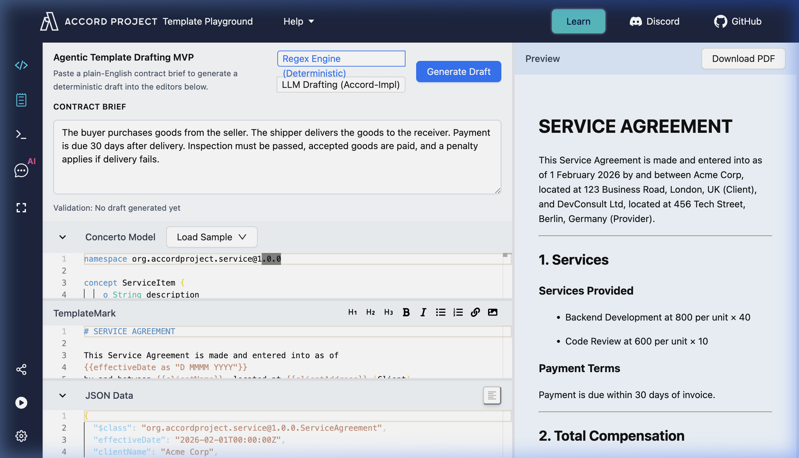
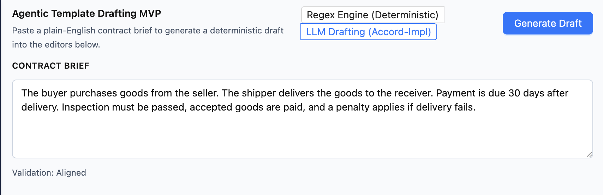
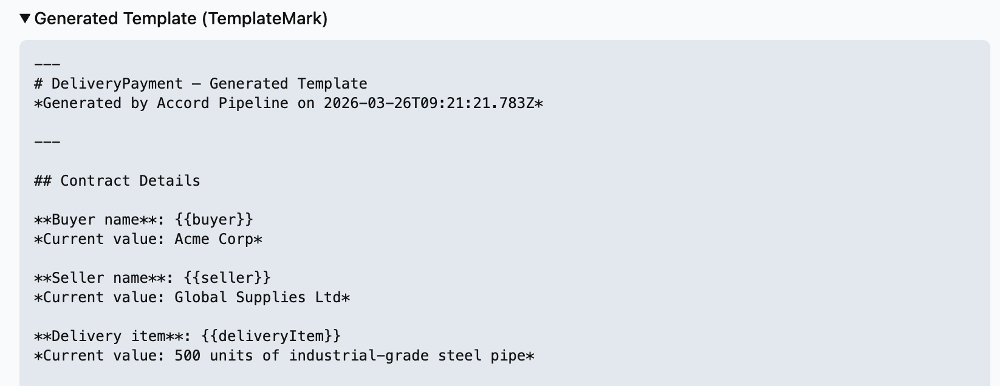
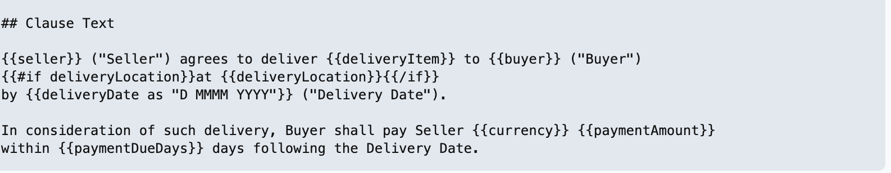
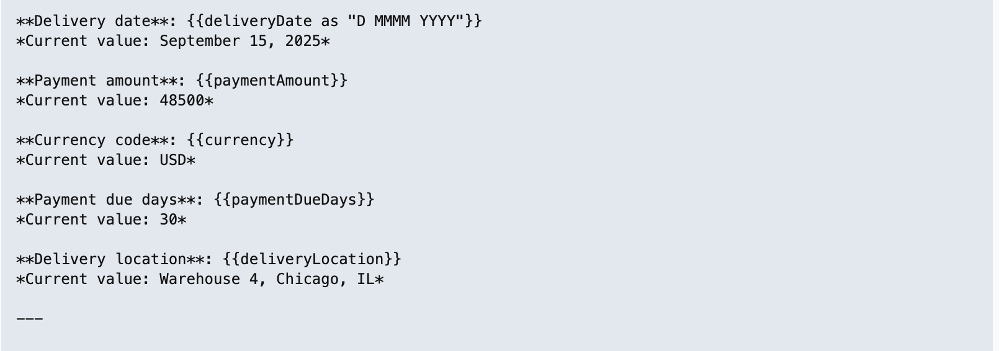
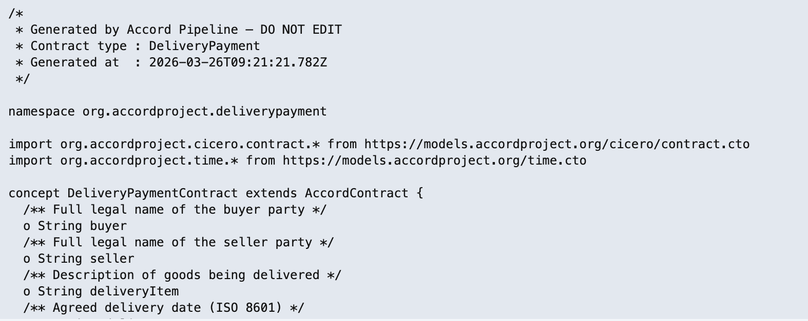
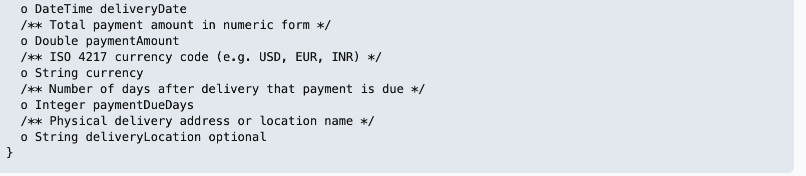
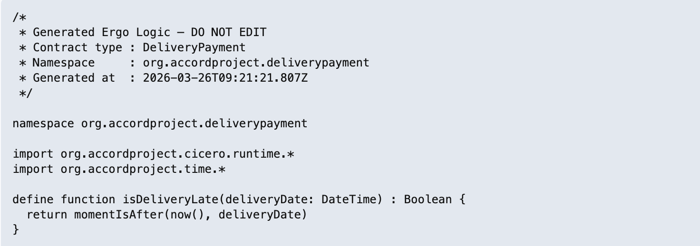
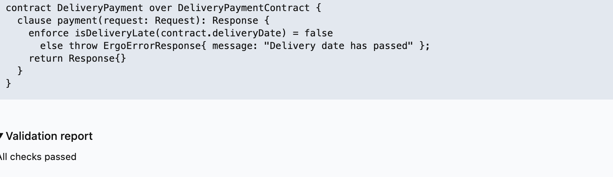

# Accord-Aware LLM Drafting System

## Overview

This project implements a **semantics-aware contract drafting system** that combines:

* **LLM-based natural language understanding (Groq)**
* **Typed Intermediate Representation (IR)**
* **Deterministic contract generation**
* **Accord Project-compatible artifacts**

### Project Context & Initial Requirements

The system was designed following the spec for a robust, model-driven drafting pipeline that ensures legal consistency and structural integrity.


---

## Core Idea

Instead of generating contracts directly using an LLM, this system enforces a strict pipeline:

```
Natural Language → LLM (Groq) → Typed IR → Deterministic Generator → Accord Template
```

### Key Principle

> **LLM interprets. The system decides.**

This ensures:

* No hallucinated contract structures
* Strong alignment with Accord’s model-driven design
* Deterministic and verifiable outputs

---

## Template Playground Integration

This system is fully integrated with the **Accord Project Template Playground**, allowing users to switch between the legacy regex engine and the new AI-powered drafting engine.



### Engine Selection
The UI allows users to toggle between the deterministic (Regex) engine and the LLM-powered engine.



### Integration Flow
1. Generate template package: `model.cto`, `grammar.tem.md`, `logic.ergo`, `package.json`.
2. Import into Playground:
   * Upload files
   * Or paste into editor
3. Test:
   * Clause parsing
   * Data binding
   * Logic execution

---

## Generated Artifacts (Visual Analysis)

The system produces three primary Accord Project artifacts from a single contract brief.

### 1. TemplateMark (Grammar)
The generated grammar includes variable bindings and formatted human-readable text.

| Details Extraction | Bound Clause Text |
| ----------------- | ---------------- |
|  |  |
|  | |

### 2. Concerto (Data Model)
The system creates a strictly typed Concerto model (`.cto`) that maps exactly to the extracted IR fields.




### 3. Ergo (Executable Logic)
For supported contract types, the system generates executable Ergo logic stubs to handle contract events.




---

## Architecture

```
User Input (Natural Language)
        ↓
LLM Provider (Groq)
        ↓
Typed IR (Contract-Type Aware)
        ↓
Schema Validation
        ↓
Deterministic Generators
   ├── model.cto
   ├── grammar.tem.md
   ├── logic.ergo
   └── package.json
        ↓
Validator + Repair Loop
```

---

## Intermediate Representation (IR)

The IR is the **semantic core** of the system.

### Properties
* Contract-type aware
* Strictly schema-bound
* Supports confidence and ambiguity markers

### Example (LatePenalty)
```json
{
  "contractType": "LatePenalty",
  "obligorParty": "FastFreight Logistics",
  "obligeeParty": "Nexus Retail Group",
  "gracePeriodDays": 3,
  "penaltyRatePercent": 1.5,
  "penaltyPeriod": "WEEKLY",
  "maxPenaltyPercent": 15,
  "currency": "USD"
}
```

---

## Validation & Repair Loop

The validator ensures structural and semantic integrity. If validation fails, errors are fed back into the LLM for a targeted repair pass, creating a **self-correcting drafting system**.

---

## How to Run

```bash
npm install
npm run demo
```

To enable Groq:
```bash
# .env file
USE_GROQ=true
GROQ_API_KEY=your_key_here
```

---

## Key Takeaway

This system transforms contract drafting from:

> Text generation problem

into:

> **Structured semantic compilation problem**

Which is exactly how Accord Project models legal contracts.

---
